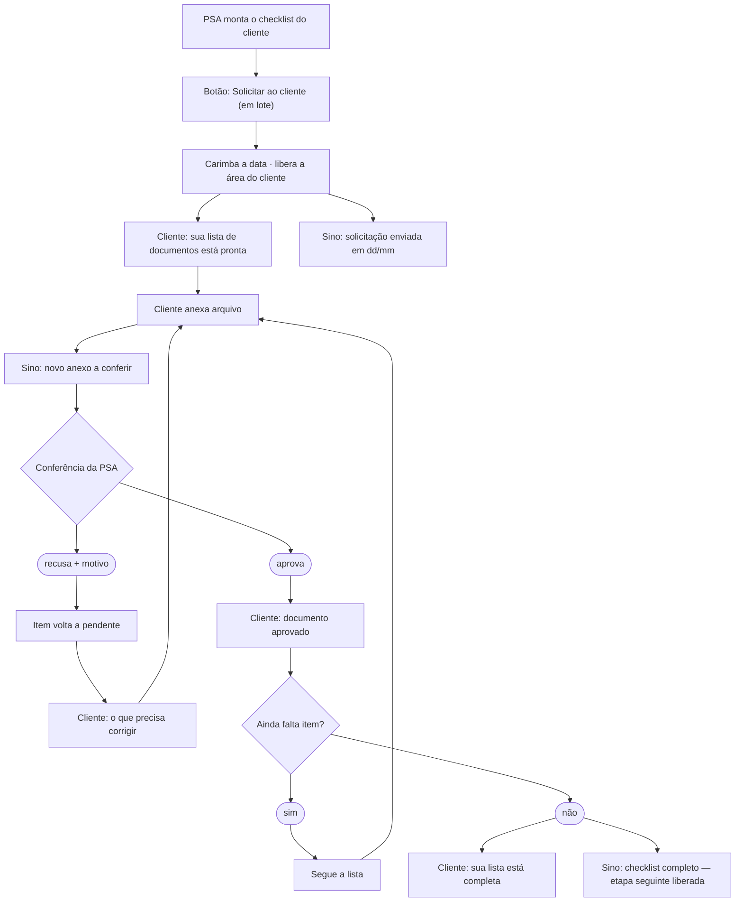
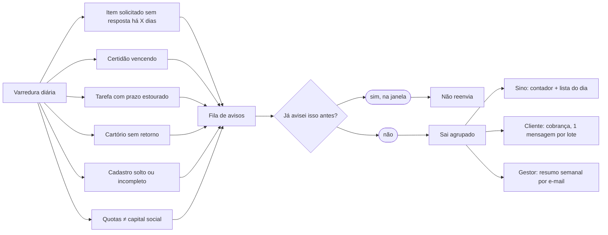
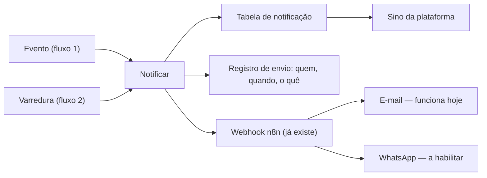

# Notificações da coleta de documentos (OSG · P1)

Mapa das automações de comunicação do P1: o que dispara cada aviso, por onde ele sai e o
que falta no banco/código para cada um. Levantado em 03/08/2026 contra o código vivo.

Versão visual (mesmo conteúdo, com os fluxogramas renderizados):
<https://claude.ai/code/artifact/44452f60-024f-4762-9838-ad1eaabfa292>

Leitura relacionada: [`plano-osg-documentos-recebidos.md`](plano-osg-documentos-recebidos.md),
[`checklist-por-subtracao.md`](checklist-por-subtracao.md),
[`../geral/notificacoes-chamados.md`](../geral/notificacoes-chamados.md).

## Princípio

Três coisas diferentes, que hoje se confundem na conversa:

| | Dispara | Exemplo |
|---|---|---|
| **Evento** | Na hora, por uma ação de alguém | cliente anexou arquivo |
| **Varredura** | Com o tempo passando, por rotina | item solicitado há 7 dias sem resposta |
| **Entrega** | Nunca decide nada; só entrega | sino, e-mail, WhatsApp |

Evento e varredura **não** falam com e-mail nem WhatsApp direto: os dois chamam a mesma
função de notificar, que grava o aviso do sino, registra o envio e entrega o externo.

## Fluxo 1 — evento: da solicitação ao documento aprovado

O botão **Solicitar ao cliente** é a peça que falta e que mais rende: libera a área do
cliente, carimba a data que a cobrança precisa e avisa os dois lados de uma vez.

## Fluxo 2 — varredura: o que só aparece com o tempo passando

O registro de envio é o que impede a mesma cobrança de sair todo dia. O sino recebe
agrupado — nunca um aviso por item, senão 63 itens de checklist viram 63 avisos.

## Fluxo 3 — entrega: uma porta só

WhatsApp entra só aqui: nenhum dos fluxos acima muda quando ele chegar. Portanto o bloco
do cliente **não** está travado nele — sai por e-mail agora.

## Os 15 avisos

Legenda da coluna "falta": `só o aviso` = dá pra fazer com o que já existe ·
**⚠️ MIGRAÇÃO** = campo/status novo no banco · `regra nova` = a conta não existe ainda.

| Aviso | Dispara quando | Recebe | Falta |
|---|---|---|---|
| **Base — o sino em si** | — | Time | ⚠️ MIGRAÇÃO: tabela de notificação (hoje o sino só lê chamados) |
| Solicitação enviada | Clique em Solicitar | Cliente | o botão (mesmo trabalho da linha seguinte) |
| Área do cliente liberada | Clique em Solicitar | Sino | o botão + parar de mostrar ao cliente o que não foi pedido |
| Cliente anexou documento | Upload do cliente | Sino | só o aviso |
| Documento recusado | Conferência recusa | Cliente | ⚠️ MIGRAÇÃO: status `recusado` + motivo |
| Documento aprovado | Conferência aprova | Cliente | ⚠️ MIGRAÇÃO: ato de aprovar (hoje o arquivo já entra valendo) |
| Checklist completo | Último item aprovado | Sino | só o aviso |
| Lista completa | Último item aprovado | Cliente | só o aviso (não estava na lista original) |
| Cobrança de item sem resposta | X dias após solicitar | Cliente | a data vem do botão + régua + registro de envio |
| Certidão vencendo | 30 e 15 dias antes | Sino | ⚠️ MIGRAÇÃO: data de validade |
| Tarefa atrasada | Prazo estourou | Sino | só a varredura (`org_tasks.due_date` já existe) |
| Prazo de retorno do cartório | Sem retorno após X dias | Sino | ⚠️ MIGRAÇÃO: saída e retorno (só o cartório está cadastrado) |
| Cadastro solto | Varredura | Sino | regra nova: matrícula órfã e afins não são calculados |
| Cadastro de pessoa incompleto | Varredura | Sino | regra nova: definir o que é "completo" |
| Divergência de quotas | Varredura | Sino | ⚠️ MIGRAÇÃO: `capital_social` (sem total não há comparação) |
| Resumo semanal de pendências | Segunda de manhã | Gestor · e-mail | o agendamento (o cálculo existe) |

## O que já existe no código (evidência)

- **Entrega externa:** `supabase/functions/notify-ticket/index.ts` — monta destinatários por
  papel (`cliente` / `responsavel` / `gestor`) e faz **um** POST para `N8N_WEBHOOK_URL`.
  Não grava nada: não há registro de envio.
- **Varredura:** `supabase/functions/check-ticket-deadlines/index.ts` — chamada por cron
  externo (API key), calcula `dias_atraso` e chama o notify. É o molde do fluxo 2.
- **Sino:** `src/components/notifications/NotificationPopover.tsx` +
  `src/hooks/useTicketNotifications.ts` — lê `tickets`. Não existe tabela de notificação.
- **Checklist:** `src/hooks/useOsgChecklist.ts`, tabelas `checklist_item_padrao` /
  `checklist_cliente_item` (migração `20260707130000_osg_checklist_schema.sql`).
- **Tela do cliente:** `src/components/cliente/ColetaDocumentosCliente.tsx` +
  RPC `get_checklist_solicitado_cliente` (`20260723173413_*.sql`).
- **Pendências do gestor:** `src/lib/auditPendencias.ts` — 6 motivos, com "como resolver" e
  CSV, na tela de auditoria. Só é sobre tarefa/projeto/OS.

## Achados que mudam o entendimento

1. **Não existe o evento "solicitação enviada".** A RPC `get_checklist_solicitado_cliente`
   devolve todos os itens exceto `dispensado` e `nao_aplicavel` — a lista aparece na área do
   cliente sem ninguém ter pedido, e o status `solicitado` é marcado item a item num select
   (`ChecklistPendentes.tsx`).
2. **Bug:** item marcado `nao_solicitado` também aparece para o cliente (mesma RPC).
3. **Não existe data de solicitação.** `checklist_cliente_item` só tem `created_at` /
   `updated_at`, e não há trigger de auditoria na tabela — `updated_at` muda em qualquer
   edição. Se o botão do fluxo 1 existir, ele carimba a data no próprio update: **sem
   migração extra**.
4. **Não existe aprovar/recusar.** `documento_arquivo.status` é o enum `osg_doc_status`
   com dois valores (`pendente`, `ativo`), e o upload já grava `ativo`
   (`useDocumentoArquivo.ts`). Um arquivo ilegível conta como recebido.
5. **Não existe data de validade de documento.** O único `data_validade` do banco é da
   tabela `impedimento` — outra coisa.
6. **Cartório:** existe a tabela `cartorio` e `matricula.cartorio_id`; não há protocolo nem
   data de saída/retorno.
7. **Quotas:** `quadro_societario` tem `quotas` e `percentual`; `capital_social` não existe
   em nenhuma tabela.
8. **"Cadastro solto" e "pessoa incompleta" não são calculados.** As pendências que existem
   hoje são de tarefa/projeto/OS. A validação de pessoa só existe no formulário. São os dois
   itens mais caros da lista.

## Ordem que se paga primeiro

1. **Botão Solicitar ao cliente** — entrega dois avisos, cria a data da cobrança e conserta
   a lista aparecendo sozinha na tela do cliente (+ o bug do `nao_solicitado`).
2. **Tabela de notificação + sino lendo dela** — destrava todos os avisos do time.
3. **Aprovar e recusar na conferência** — fecha o ciclo do documento; são os dois avisos que
   o cliente mais espera.
4. **Varredura diária com registro de envio** — liga cobrança, tarefa atrasada e resumo do
   gestor no mesmo mecanismo.
5. **Campos novos, um a um** — validade de certidão, capital social, ida e volta do cartório.
6. **Regras de cadastro solto e pessoa incompleta** — as mais caras, deixar por último.
